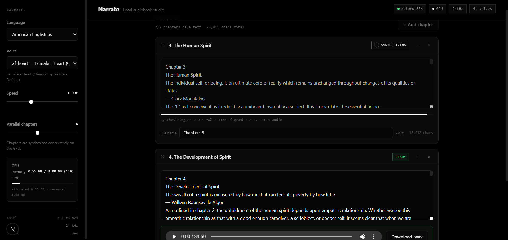

# Narrate — Local-first Audiobook Synthesizer

Turn any book into an audiobook on your own machine. Paste chapters, narrate them **in parallel on your GPU**, and download studio-quality WAV files — completely offline, no cloud, no API keys.

Built on [Kokoro-82M](https://github.com/hexgrad/kokoro) (a lightweight, natural-sounding open-source TTS model) with a **FastAPI** backend and a **Next.js** frontend.



## Features

- **Chapter-based workflow** — paste a chapter, add another, edit freely; narrate them all with one click
- **Parallel GPU synthesis** — all chapters are generated concurrently on your GPU (configurable 1–8 workers)
- **Live progress** — per-chapter determinate progress bars from the model itself (`audio generated vs. estimate`), plus a continuous overall job bar with elapsed time
- **GPU memory meter** — live VRAM usage while generating, and a projected-memory estimate that updates as you add chapters (pulses red when you approach the card's limit)
- **Custom file names** — every chapter has its own output name; `Download all` bundles them into a ZIP
- **Refresh persistence** — your manuscript, narrator settings, and even an in-flight job survive a page refresh (localStorage + backend job resume)
- **40+ voices, 7 languages** — American/British English, Spanish, French, Hindi, Italian, Portuguese
- **Self-healing** — automatic backend reconnection, job watchdog with timeouts, graceful recovery when a job is lost

## Requirements

| Component | Requirement |
| --- | --- |
| Python | 3.10+ (tested on 3.12) |
| GPU | NVIDIA GPU with CUDA recommended (CPU mode works, much slower) |
| Node.js | 18+ |
| First run | Internet needed to download the Kokoro model + voice packs from HuggingFace (~330 MB, cached locally afterwards) |

## Quick Start

```bash
# 1. Backend
cd backend
pip install -r requirements.txt
python -m uvicorn main:app --port 8000

# 2. Frontend (new terminal)
cd frontend
npm install
npm run dev
```

Open **http://localhost:3000**. See [GUIDE.md](GUIDE.md) for a full walkthrough.

> The model and voices are downloaded to your HuggingFace cache on first run — only the first launch needs internet.

## How It Works

```
┌───────────────────────┐   POST /api/audiobook/generate   ┌───────────────────────────┐
│  Next.js frontend     │ ────────────────────────────────► │  FastAPI backend          │
│  · chapter manager    │                                   │  · job manager (threads)  │
│  · live progress bar  │ ◄────── GET /api/audiobook/status │  · ThreadPoolExecutor     │
│  · GPU memory meter   │      (poll every 600 ms)         │  · GPU memory watchdog    │
│  · localStorage state │                                   │  · Kokoro KPipeline cache │
└───────────────────────┘                                   └───────────────────────────┘
```

- Each chapter is synthesized in its own worker thread against a shared, cached Kokoro pipeline.
- Kokoro splits text into ≤510-token phoneme windows internally; the engine reports **real progress** after every model inference pass (cumulative audio seconds ÷ estimate), which drives the progress bars.
- Every job gets a deadline derived from its text volume; a watchdog fails jobs that overrun so the UI can never poll forever.
- `app.py` at the repo root is the original Streamlit reference implementation this project was inspired by.

## API Reference

| Endpoint | Method | Description |
| --- | --- | --- |
| `/api/health` | GET | Server + model + hardware status |
| `/api/gpu` | GET | Live VRAM stats (total/free/allocated/reserved/base) |
| `/api/voices` | GET | Voice catalog grouped by language |
| `/api/audiobook/generate` | POST | Start parallel narration of chapters → `{ job_id }` |
| `/api/audiobook/status/{job_id}` | GET | Per-chapter progress, errors, and base64 WAV results |
| `/api/audiobook/download/{job_id}` | GET | ZIP of all completed chapters |
| `/api/synthesize` | POST | Single-shot synthesis (WAV) — used by chapter retry |

## Project Structure

```
├── backend/
│   ├── main.py            # FastAPI app, audiobook job manager, watchdog
│   ├── tts_engine.py      # Kokoro pipeline wrapper, GPU stats, progress callback
│   ├── models.py          # Pydantic request/response models
│   └── voice_catalog.py   # Voices + sample presets
├── frontend/
│   └── src/
│       ├── app/           # Next.js App Router pages + theme
│       ├── components/    # ChapterCard, ChaptersPanel, ProgressBar, GpuMeter, …
│       └── lib/           # API client, formatting helpers
├── screenshot/            # UI screenshots
└── app.py                 # Original Streamlit reference (legacy)
```

## Notes & Caveats

- **Memory**: audio chunks are moved to CPU immediately during generation, keeping VRAM bounded (~900 MB peak measured on an RTX 3050 4 GB during a 44-minute chapter).
- **Limits**: 100,000 characters per chapter; up to 50 chapters per book.
- **Jobs are in-memory**: restarting the backend loses running jobs (the UI detects this and recovers gracefully).
- **CPU mode** works but is ~20–50× slower than GPU — keep "Parallel chapters" low.
